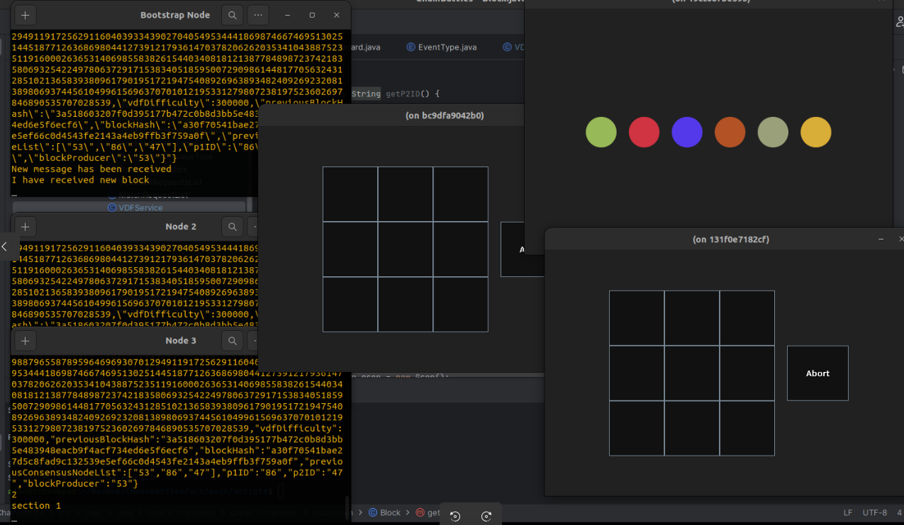

# Current Implementation and Future Development
## Simplified Kademlia DHT
In our current implementation, we have successfully developed a simplified version of the Kademlia Distributed Hash Table (DHT). This technology enables peer discovery within the network, allowing players to find and connect with each other in a decentralized manner. With our working peer discovery mechanism, players can easily locate opponents and initiate turn-based gameplay. This achievement demonstrates our commitment to building a robust decentralized gaming architecture.

## Wesolowski VDF for Unbiased Randomness
As part of our current implementation, we have integrated the Wesolowski Verifiable Delay Function (VDF) into our system. The VDF provides a source of unbiased randomness, crucial for fair gameplay experiences. By utilizing this technology, we can shuffle the consensus nodes list, which consists of potential block producers, in a way that ensures equal opportunities for all participants. While our implementation of the VDF is a work in progress, we are excited about its potential to enhance the fairness and unpredictability of our game system.

### Understanding Wesolowski VDF
The Wesolowski Verifiable Delay Function (VDF) is a cryptographic primitive that introduces a time delay while enabling the verification of the computation. It involves performing complex mathematical calculations that require a significant amount of time to complete. However, once the computation is finished, the result can be efficiently verified. In our case, we utilize the VDF to generate an unbiased random seed, which we use to shuffle the consensus nodes list. This process ensures a fair selection of the next block producer and enhances the overall fairness of the game system.

## Blockchain Integration for Matchmaking
In our ongoing development, we have started integrating blockchain technology for matchmaking purposes. As consensus nodes calculate the VDF, they also cache incoming requests from peers seeking game partners. After the VDF calculation and selection of the new block producer, the block producer retrieves the cached matchmaking requests, matches players together, and stores the pairs in a new block. This block is then broadcasted across the network, facilitating the matchmaking process. While our current implementation of blockchain-based matchmaking is a work in progress, we are actively refining this functionality to enhance the overall gaming experience.

## Testing in Docker Environment


Simple TicTacToe Game (Disclaimer does not work!)

To test our Decentralized Turn-Based Game System in a Docker environment, follow these steps:

1. Ensure you have Docker installed on your machine.

2. Open a terminal and navigate to the root directory of the project.

3. Run the following command to build the Docker image:

```bash
  docker build -t my-app:1.0
```

4. Once the image is built, execute the provided script to run a small network of three nodes for a simple demonstration. The script will automatically create three Docker containers representing each node. It will open separate terminals for each container, allowing you to observe and interact with the system. The Kademlia routing table of each node can be displayed by typing the "/print" command in the respective terminal.

```bash
    #!/bin/bash

JAR_NAME=my-app
JAR_VERSION=1.0

# Remove old containers and images
docker rm -f $(docker ps -aq)
docker image rm $JAR_NAME:$JAR_VERSION

# Build the Docker image
docker build -t $JAR_NAME:$JAR_VERSION ../../../.

# Running containers in different terminals
gnome-terminal --geometry=60x15+50+50 --title="Bootstrap Node" -- docker run --name bootstrp -it --rm -e ARG1="true" --ip="172.17.0.2" -e DISPLAY=$DISPLAY -v /tmp/.X11-unix:/tmp/.X11-unix:ro $JAR_NAME:$JAR_VERSION
gnome-terminal --geometry=60x15+50+395 --title="Node 2" -- docker run -it --rm -e ARG1="false" -e DISPLAY=$DISPLAY -v /tmp/.X11-unix:/tmp/.X11-unix:ro $JAR_NAME:$JAR_VERSION
gnome-terminal --geometry=60x15+50+740 --title="Node 3" -- docker run -it --rm -e ARG1="false" -e DISPLAY=$DISPLAY -v /tmp/.X11-unix:/tmp/.X11-unix:ro $JAR_NAME:$JAR_VERSION

```

5. Follow the instructions provided within the terminals to interact with the nodes and observe the peer discovery process.

Please note that this is a simplified demonstration environment, and further development and refinement are ongoing. We appreciate your participation in testing our system and welcome any feedback or suggestions you may have.


## Future Roadmap
Moving forward, we have an exciting roadmap ahead for the Decentralized Turn-Based Game System:

**Enhanced Security**: We plan to fully integrate blockchain technology to provide even greater security and data integrity within our game system. This will ensure that all gameplay actions are securely recorded and cannot be manipulated.

**Advanced Features**: We are dedicated to implementing additional features such as player matchmaking, game state synchronization, and rewards distribution. These features will further enhance the overall gaming experience and engage our player community.

**Scalability and Performance**: We will continue optimizing the system for improved scalability and performance. Our goal is to accommodate a growing number of players and handle increased game activity while maintaining a smooth and responsive gameplay environment.

**User Feedback and Iteration**: We highly value user feedback and will actively seek insights from our community. This input will be crucial in refining and improving our system to meet the needs and expectations of players.

## References


[1] [Author(s). "Implementation Study of Two Verifiable Delay Functions." Journal/Conference Name, Year.](https://www.researchgate.net/publication/349760306_Implementation_Study_of_Two_Verifiable_Delay_Functions)

[2] [DHT Walkthrough Notes] (https://gist.github.com/gubatron/cd9cfa66839e18e49846)